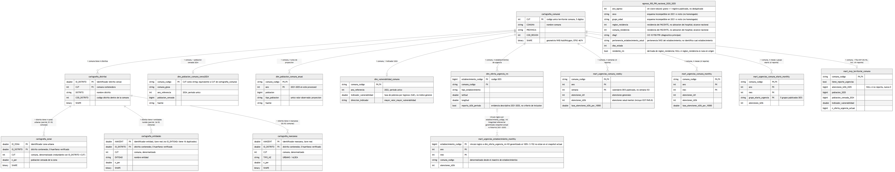
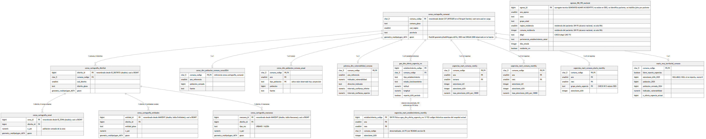

# Modelo de base de datos

Evidencia académica del ítem 15 del proyecto APT: *"Modelo de base de datos — Entidades, atributos, relaciones, PK, FK y cardinalidades — Crear diagrama entidad relación — Confirmar si existe; si no, crear desde cero a partir de requisitos y demo."*

## 1. Objetivo

Documentar de forma trazable y reproducible:

1. el **modelo lógico** de los datos analíticos canónicos tal como existen hoy en `data/processed/` (archivos Parquet/CSV, sin motor de base de datos activo), con sus entidades, atributos principales, grano, llaves y relaciones reales; y
2. el **modelo físico objetivo** para la futura persistencia en PostgreSQL con extensión PostGIS — el stack de base de datos ya definido en el `README.md` raíz del proyecto —, junto con un DDL ejecutable (`db/schema_postgresql.sql`) que crea ese esquema vacío.

## 2. Estado previo / confirmación de existencia

Se realizó una búsqueda dirigida antes de crear cualquier artefacto:

- `docs/07-diagramas/`: solo contenía `casos_de_uso_saad.*` y `componentes_saad.*` (diagramas UML de casos de uso y de componentes, PlantUML). **Ningún ERD ni modelo de datos.**
- Búsqueda de extensiones `*.mmd`, `*.mermaid`, `*.puml`, `*.dbml`, `*.drawio` en todo el repositorio: solo los dos `.puml` ya mencionados (UML, no ERD).
- Búsqueda de `*.sql` relacionado con schema/modelo: **ningún archivo `.sql` existía en el repositorio antes de esta tarea.**
- Búsqueda de los términos "ERD", "entidad-relación", "modelo lógico", "modelo físico": aparecen únicamente como referencias de política en `.agents/rules.md` (estructura de `reports/`) y como pendiente futuro en `PROJECT_CONTEXT.md` ("preparar el ERD" listado en "Siguiente frente lógico aproximado"), nunca como un diagrama o modelo ya construido.

**Conclusión: no existía un modelo de base de datos previo.** Este entregable se creó desde cero a partir de los contratos reales de los datasets (esquemas Parquet, diccionarios en `reports/dictionary/`, EDA en `reports/eda/`) y de las restricciones normativas de `AGENTS.md` / `PROJECT_CONTEXT.md` / `.agents/rules.md`.

## 3. Alcance

**Incluido** (según lo solicitado explícitamente en la tarea, inspeccionado directamente sobre los Parquet/CSV publicados):

- Cartografía Censo 2024 RM: Comunal, Distrital, Zonal, Entidades, Manzanas (`data/processed/censo/Cartografia_censo2024_RM_*.parquet`).
- `dim_poblacion_comuna_censo2024`, `dim_poblacion_comuna_anual` (`data/processed/censo/`).
- `dim_vulnerabilidad_comuna` (`data/processed/pobreza/`).
- `dim_oferta_urgencia_rm` (`data/processed/geo/`).
- `mart_urgencias_comuna_weekly`, `mart_urgencias_comuna_monthly`, `mart_urgencias_establecimiento_monthly`, `mart_urgencias_comuna_etario_monthly` (`data/processed/marts/`).
- `mart_mvp_territorial_comuna` (`data/processed/marts/`).
- `egresos_f00_f99_nacional_2020_2025` (`data/processed/egresos/`).

**Excluido deliberadamente:**

- `data/processed/contexto_genero/*` (PHQ-4, síntomas depresivos, egresos por intento suicida por sexo, ratios de suicidio H/M). Son indicadores oficiales de contexto interpretativo externo. `AGENTS.md` y `PROJECT_CONTEXT.md` son explícitos: **no se cruzan automáticamente con Urgencias/Egresos ni se convierten automáticamente en features.** Persistirlos en este mismo modelo relacional, con FK hacia las entidades territoriales, insinuaría una relación de join automático que el proyecto prohíbe explícitamente. Quedan fuera del alcance de este ítem; si en el futuro se decide persistirlos, deben modelarse como un dominio separado, sin FK hacia Urgencias/Egresos.
- Catálogo CIE-10 (`data/processed/egresos/catalogo_cie10_f00_f99.csv`, `data/processed/urgencias/catalogo_f00_f99.csv`): no fue solicitado como entidad del modelo; no se inventa como tabla adicional.
- El maestro general de establecimientos de salud (`establecimientos_rm_clean.parquet`, `establecimientos_salud_clean.parquet`) no forma parte de este ítem: la tarea pidió específicamente `dim_oferta_urgencia_rm` (subconjunto vigente de oferta de urgencia), no el maestro completo.

## 4. Convenciones

- **Modelo lógico** (`modelo_datos_logico.mmd`): describe los datos **tal como existen hoy**. Los archivos Parquet/CSV en `data/processed/` **no tienen constraints SQL activos**; las PK/FK del diagrama lógico son llaves **lógicas**, verificadas empíricamente sobre los datos (sin duplicados, sin nulos, dominios subconjunto), no restricciones físicas ya implementadas.
- **Modelo físico** (`modelo_datos_fisico_postgresql.mmd` + `db/schema_postgresql.sql`): diseño **objetivo** para PostgreSQL/PostGIS. Es el stack de base de datos que el proyecto ya definió (`README.md` raíz, sección de stack tecnológico: *"Base de Datos: PostgreSQL con extensión PostGIS"*). **PostgreSQL/PostGIS es la arquitectura de persistencia objetivo, no una alternativa a futuro por decidir.** Lo que sí permanece sin implementar es el **despliegue** (AWS/RDS, Docker) y la **capa de accesibilidad geoespacial** (OSM/GTFS, isócronas, cobertura poblacional): ninguna de las dos cosas es requisito para modelar correctamente las geometrías censales que ya existen en los Parquet fuente.
- Distinción de llaves en ambos modelos:
  - **clave natural real**: existe en la fuente y es verificablemente única (ej. `CUT`/`comuna_codigo`, `establecimiento_codigo`, `ID_DISTRITO`, `ID_ZONA`, `MANZENT`).
  - **clave lógica**: combinación de columnas de grano verificada sin duplicados (ej. `comuna_codigo + ano + semana`).
  - **clave técnica propuesta**: no existe en la fuente, se propone para el modelo físico (ej. `egreso_id`).
  - **ausencia de clave natural**: declarada explícitamente cuando corresponde (Egresos).

## 5. Modelo lógico

Artefacto visual persistente (PNG, generado desde el `.mmd` con Mermaid CLI):

Fuentes: [`modelo_datos_logico.mmd`](modelo_datos_logico.mmd) (Mermaid, editable) · [`modelo_datos_logico.svg`](modelo_datos_logico.svg) (vectorial).

```mermaid
%%{init: {"theme": "neutral"}}%%
erDiagram

    cartografia_comunal {
        int CUT PK "codigo unico territorial comuna, 5 digitos"
        string COMUNA "nombre comuna"
        string PROVINCIA
        int COD_REGION
        binary SHAPE "geometria WKB MultiPolygon, EPSG 4674"
    }

    cartografia_distrital {
        double ID_DISTRITO PK "identificador distrito censal"
        int CUT FK "comuna contenedora"
        string DISTRITO "nombre distrito"
        int COD_DISTRITO "codigo distrito dentro de la comuna"
        binary SHAPE
    }

    cartografia_zonal {
        double ID_ZONA PK "identificador zona urbana"
        double ID_DISTRITO FK "distrito contenedor, 0 huerfanos verificado"
        int CUT "comuna, denormalizado (redundante con ID_DISTRITO->CUT)"
        double n_per "poblacion censada de la zona"
        binary SHAPE
    }

    cartografia_entidades {
        double MANZENT PK "identificador entidad, llave real (no ID_ENTIDAD: tiene 16 duplicados)"
        double ID_DISTRITO FK "distrito contenedor, 0 huerfanos verificado"
        int CUT "comuna, denormalizado"
        string ENTIDAD "nombre entidad"
        double n_per
        binary SHAPE
    }

    cartografia_manzanas {
        double MANZENT PK "identificador manzana, llave real"
        double ID_DISTRITO FK "distrito contenedor, 0 huerfanos verificado"
        int CUT "comuna, denormalizado"
        string TIPO_MZ "URBANO / ALDEA"
        double n_per
        binary SHAPE
    }

    dim_poblacion_comuna_censo2024 {
        string comuna_codigo PK "CUT como string; equivalente a CUT de cartografia_comunal"
        string comuna_glosa
        int ano_referencia "2024, periodo unico"
        bigint poblacion_censada
        string fuente
    }

    dim_poblacion_comuna_anual {
        string comuna_codigo PK, FK
        int ano PK "2021-2025 en este processed"
        bigint poblacion
        string tipo_poblacion "unico valor observado: proyeccion"
        string fuente
    }

    dim_vulnerabilidad_comuna {
        string comuna_codigo PK, FK
        int ano_referencia "2022, periodo unico"
        double indicador_vulnerabilidad "tasa de pobreza por ingresos (SAE), no indice general"
        string direccion_indicador "mayor_valor_mayor_vulnerabilidad"
    }

    dim_oferta_urgencia_rm {
        bigint establecimiento_codigo PK "codigo DEIS"
        string comuna_codigo FK
        string tipo_establecimiento
        double latitud
        double longitud
        bool reporto_id36_periodo "evidencia descriptiva 2021-2025, no criterio de inclusion"
    }

    mart_urgencias_comuna_weekly {
        string comuna_codigo PK, FK
        int ano PK
        int semana PK "calendario DEIS publicado, no semana ISO"
        int atenciones_id1 "atenciones generales"
        int atenciones_id36 "atenciones salud mental (incluye ID37/R45.8)"
        double tasa_atenciones_id36_por_10000
    }

    mart_urgencias_comuna_monthly {
        string comuna_codigo PK, FK
        int ano PK
        int mes PK
        int atenciones_id1
        int atenciones_id36
        double tasa_atenciones_id36_por_10000
    }

    mart_urgencias_establecimiento_monthly {
        bigint establecimiento_codigo PK "vinculo logico a dim_oferta_urgencia_rm NO garantizado al 100%: 3/152 no estan en el snapshot actual"
        int ano PK
        int mes PK
        string comuna_codigo "denormalizado desde el maestro de establecimientos"
        int atenciones_id36
    }

    mart_urgencias_comuna_etario_monthly {
        string comuna_codigo PK, FK
        int ano PK
        int mes PK
        string grupo_etario_urgencia PK "5 grupos publicados DEIS"
        int atenciones_id36
    }

    mart_mvp_territorial_comuna {
        string comuna_codigo PK, FK
        bool tiene_reporte_urgencias
        bigint atenciones_id36_2025 "NULL si no reporta, nunca 0"
        bigint poblacion_2025
        bigint poblacion_censada_2024
        double indicador_vulnerabilidad
        bigint n_oferta_urgencia_actual
    }

    egresos_f00_f99_nacional_2020_2025 {
        int ano_egreso "sin clave natural: grano = 1 registro publicado, no deduplicado"
        string sexo "esquema incompatible en 2021 vs resto (no homologado)"
        string grupo_edad "esquema incompatible en 2021 vs resto (no homologado)"
        int region_residencia "residencia del PACIENTE, no ubicacion del hospital; alcance nacional"
        int comuna_residencia "residencia del PACIENTE, no ubicacion del hospital; alcance nacional"
        string diag1 "CIE-10 F00-F99 (diagnostico principal)"
        string pertenencia_establecimiento_salud "pertenencia SNSS del establecimiento; no identifica cual establecimiento"
        int dias_estada
        bool residente_rm "derivada de region_residencia; NULL si region_residencia es nula en origen"
    }

    cartografia_comunal ||--o{ cartografia_distrital : "1 comuna tiene N distritos"
    cartografia_distrital ||--o{ cartografia_zonal : "1 distrito tiene N zonas urbanas (parcial: 51/52 comunas)"
    cartografia_distrital ||--o{ cartografia_entidades : "1 distrito tiene N entidades rurales (parcial: 26/52 comunas)"
    cartografia_distrital ||--o{ cartografia_manzanas : "1 distrito tiene N manzanas (52/52 comunas)"

    cartografia_comunal ||--o| dim_poblacion_comuna_censo2024 : "1 comuna, 1 poblacion censada 2024"
    cartografia_comunal ||--o{ dim_poblacion_comuna_anual : "1 comuna, N anos de proyeccion"
    cartografia_comunal ||--o| dim_vulnerabilidad_comuna : "1 comuna, 1 indicador 2022"
    cartografia_comunal ||--o{ dim_oferta_urgencia_rm : "1 comuna, N establecimientos de urgencia"

    cartografia_comunal ||--o{ mart_urgencias_comuna_weekly : "1 comuna, N semanas (si reporta)"
    cartografia_comunal ||--o{ mart_urgencias_comuna_monthly : "1 comuna, N meses (si reporta)"
    cartografia_comunal ||--o{ mart_urgencias_comuna_etario_monthly : "1 comuna, N meses x grupo etario (si reporta)"
    cartografia_comunal ||--o| mart_mvp_territorial_comuna : "1 comuna, 1 fila MVP (52/52, incl. sin reporte)"

    dim_oferta_urgencia_rm |o..o{ mart_urgencias_establecimiento_monthly : "vinculo logico por establecimiento_codigo, NO integridad referencial garantizada"
```

Fuente independiente (idéntica): [`modelo_datos_logico.mmd`](modelo_datos_logico.mmd).

`egresos_f00_f99_nacional_2020_2025` aparece **sin relaciones** hacia el resto del diagrama: es intencional. No existe llave compartida con Urgencias ni con establecimientos (ver sección 8, invariante de no enlace por paciente/establecimiento).

Las capas `cartografia_zonal`, `cartografia_entidades` y `cartografia_manzanas` publican además ~150 columnas socioeconómicas (`n_*`, `prom_*`) no documentadas formalmente por el diccionario oficial del Censo 2024 (ver `reports/eda/eda_cartografia_censo2024_subcomunal.md`); no se listan en el diagrama por volumen, no porque no existan.

## 6. Modelo físico objetivo PostgreSQL/PostGIS

Artefacto visual persistente (PNG, generado desde el `.mmd` con Mermaid CLI):

Fuentes: [`modelo_datos_fisico_postgresql.mmd`](modelo_datos_fisico_postgresql.mmd) (Mermaid, editable) · [`modelo_datos_fisico_postgresql.svg`](modelo_datos_fisico_postgresql.svg) (vectorial).

```mermaid
%%{init: {"theme": "neutral"}}%%
erDiagram

    censo_cartografia_comunal {
        char_5 comuna_codigo PK "renombrado desde CUT (INTEGER en el Parquet fuente); cast+zero-pad en carga"
        text comuna_glosa
        smallint cod_region
        text provincia
        geometry_multipolygon_4674 geom "PostGIS geometry(MultiPolygon,4674), SRID real SIRGAS 2000 observado en la fuente"
    }

    censo_cartografia_distrital {
        bigint distrito_id PK "renombrado desde ID_DISTRITO (double); cast a BIGINT"
        char_5 comuna_codigo FK
        smallint cod_distrito
        text distrito_glosa
        geometry_multipolygon_4674 geom
    }

    censo_cartografia_zonal {
        bigint zona_id PK "renombrado desde ID_ZONA (double); cast a BIGINT"
        bigint distrito_id FK
        numeric n_per "poblacion censada de la zona"
        geometry_multipolygon_4674 geom
    }

    censo_cartografia_entidades {
        bigint entidad_id PK "renombrado desde MANZENT (double, tabla Entidades); cast a BIGINT"
        bigint distrito_id FK
        text entidad_glosa
        numeric n_per
        geometry_multipolygon_4674 geom
    }

    censo_cartografia_manzanas {
        bigint manzana_id PK "renombrado desde MANZENT (double, tabla Manzanas); cast a BIGINT"
        bigint distrito_id FK
        text tipo_mz "URBANO / ALDEA"
        numeric n_per
        geometry_multipolygon_4674 geom
    }

    censo_dim_poblacion_comuna_censo2024 {
        char_5 comuna_codigo PK, FK "referencia censo.cartografia_comunal"
        smallint ano_referencia
        bigint poblacion_censada
        text fuente
    }

    censo_dim_poblacion_comuna_anual {
        char_5 comuna_codigo PK, FK
        smallint ano PK
        text tipo_poblacion PK "unico valor observado hoy: proyeccion"
        bigint poblacion
        text fuente
    }

    pobreza_dim_vulnerabilidad_comuna {
        char_5 comuna_codigo PK, FK
        smallint ano_referencia
        numeric indicador_vulnerabilidad
        text direccion_indicador
        numeric intervalo_confianza_inferior
        numeric intervalo_confianza_superior
    }

    geo_dim_oferta_urgencia_rm {
        bigint establecimiento_codigo PK
        char_5 comuna_codigo FK
        text tipo_establecimiento
        text estado_funcionamiento
        numeric latitud
        numeric longitud
        boolean reporto_id36_periodo
    }

    urgencias_mart_comuna_weekly {
        char_5 comuna_codigo PK, FK
        smallint ano PK
        smallint semana PK
        integer atenciones_id1
        integer atenciones_id36
        numeric tasa_atenciones_id36_por_10000
    }

    urgencias_mart_comuna_monthly {
        char_5 comuna_codigo PK, FK
        smallint ano PK
        smallint mes PK
        integer atenciones_id1
        integer atenciones_id36
        numeric tasa_atenciones_id36_por_10000
    }

    urgencias_mart_establecimiento_monthly {
        bigint establecimiento_codigo PK "SIN FK fisica a geo_dim_oferta_urgencia_rm: 3/152 codigos historicos ausentes del snapshot actual"
        smallint ano PK
        smallint mes PK
        char_5 comuna_codigo "denormalizado, sin FK (ver seccion 8)"
        integer atenciones_id36
    }

    urgencias_mart_comuna_etario_monthly {
        char_5 comuna_codigo PK, FK
        smallint ano PK
        smallint mes PK
        text grupo_etario_urgencia PK "CHECK IN 5 valores DEIS"
        integer atenciones_id36
    }

    marts_mvp_territorial_comuna {
        char_5 comuna_codigo PK, FK
        boolean tiene_reporte_urgencias
        bigint atenciones_id36_2025 "NULLABLE: NULL si no reporta, nunca 0"
        bigint poblacion_2025
        bigint poblacion_censada_2024
        numeric indicador_vulnerabilidad
        bigint n_oferta_urgencia_actual
    }

    egresos_f00_f99_nacional {
        bigint egreso_id PK "surrogate tecnico GENERATED ALWAYS AS IDENTITY; no existe en DEIS, no identifica paciente, no habilita joins por paciente"
        smallint ano_egreso
        text sexo
        text grupo_edad
        smallint region_residencia "residencia del paciente; SIN FK (alcance nacional, no solo RM)"
        integer comuna_residencia "residencia del paciente; SIN FK (alcance nacional, no solo RM)"
        text diag1 "CHECK diag1 LIKE 'F%'"
        text pertenencia_establecimiento_salud
        integer dias_estada
        boolean residente_rm
    }

    censo_cartografia_comunal ||--o{ censo_cartografia_distrital : "1 comuna, N distritos"
    censo_cartografia_distrital ||--o{ censo_cartografia_zonal : "1 distrito, N zonas urbanas"
    censo_cartografia_distrital ||--o{ censo_cartografia_entidades : "1 distrito, N entidades rurales"
    censo_cartografia_distrital ||--o{ censo_cartografia_manzanas : "1 distrito, N manzanas"

    censo_cartografia_comunal ||--o| censo_dim_poblacion_comuna_censo2024 : "1 a 1"
    censo_cartografia_comunal ||--o{ censo_dim_poblacion_comuna_anual : "1 a N (anos)"
    censo_cartografia_comunal ||--o| pobreza_dim_vulnerabilidad_comuna : "1 a 1"
    censo_cartografia_comunal ||--o{ geo_dim_oferta_urgencia_rm : "1 a N (establecimientos)"

    censo_cartografia_comunal ||--o{ urgencias_mart_comuna_weekly : "1 a N (si reporta)"
    censo_cartografia_comunal ||--o{ urgencias_mart_comuna_monthly : "1 a N (si reporta)"
    censo_cartografia_comunal ||--o{ urgencias_mart_comuna_etario_monthly : "1 a N (si reporta)"
    censo_cartografia_comunal ||--o| marts_mvp_territorial_comuna : "1 a 1"

    geo_dim_oferta_urgencia_rm |o..o{ urgencias_mart_establecimiento_monthly : "relacion documentada, NO enforced por FK fisica"
```

Fuente independiente (idéntica): [`modelo_datos_fisico_postgresql.mmd`](modelo_datos_fisico_postgresql.mmd).

**Arquitectura objetivo vs. despliegue vs. backlog** (para no confundir tres cosas distintas):

| Capa | Estado |
|---|---|
| PostgreSQL + PostGIS | **Arquitectura de persistencia objetivo ya definida** (`README.md` raíz). Este ítem entrega su DDL de creación de esquema. |
| AWS / RDS | Despliegue futuro, **no implementado**. Este DDL no asume ni configura infraestructura cloud. |
| OSM / GTFS / isócronas | Funcionalidad geoespacial de accesibilidad, **en backlog** (`PROJECT_CONTEXT.md`, "Pendientes principales"). No es requisito para modelar correctamente las geometrías censales que ya existen en los Parquet fuente; por eso las columnas `geom` sí usan tipos PostGIS nativos en este DDL. |

Los esquemas PostgreSQL (`censo`, `pobreza`, `geo`, `urgencias`, `marts`, `egresos`) replican 1:1 los subdirectorios de `data/processed/` para trazabilidad directa entre el dataset canónico y su tabla objetivo.

## 7. Tabla resumen

| Entidad | Grain | PK | FK | Cardinalidad principal |
|---|---|---|---|---|
| `cartografia_comunal` | 1 comuna RM (52 filas) | `comuna_codigo` | — | 1 → N distritos |
| `cartografia_distrital` | 1 distrito censal (451 filas RM) | `distrito_id` | `comuna_codigo` → `cartografia_comunal` | 1 → N zonas / entidades / manzanas |
| `cartografia_zonal` | 1 zona urbana (1865 filas RM, 51/52 comunas) | `zona_id` | `distrito_id` → `cartografia_distrital` | N → 1 distrito |
| `cartografia_entidades` | 1 entidad rural dispersa (2072 filas RM, 26/52 comunas) | `entidad_id` (= `MANZENT`, no `ID_ENTIDAD`) | `distrito_id` → `cartografia_distrital` | N → 1 distrito |
| `cartografia_manzanas` | 1 manzana urbana+aldea (66873 filas RM, 52/52 comunas) | `manzana_id` (= `MANZENT`) | `distrito_id` → `cartografia_distrital` | N → 1 distrito |
| `dim_poblacion_comuna_censo2024` | 1 comuna, periodo único 2024 (52 filas) | `comuna_codigo` | `comuna_codigo` → `cartografia_comunal` | 1 → 1 comuna |
| `dim_poblacion_comuna_anual` | comuna × año × tipo_poblacion (260 filas, 2021-2025) | `comuna_codigo, ano, tipo_poblacion` | `comuna_codigo` → `cartografia_comunal` | N → 1 comuna |
| `dim_vulnerabilidad_comuna` | 1 comuna, periodo único Casen 2022 (52 filas) | `comuna_codigo` | `comuna_codigo` → `cartografia_comunal` | 1 → 1 comuna |
| `dim_oferta_urgencia_rm` | 1 establecimiento, snapshot actual (174 filas) | `establecimiento_codigo` | `comuna_codigo` → `cartografia_comunal` | N → 1 comuna |
| `mart_urgencias_comuna_weekly` | comuna × año × semana DEIS (13362 filas, 51/52 comunas) | `comuna_codigo, ano, semana` | `comuna_codigo` → `cartografia_comunal` | N → 1 comuna |
| `mart_urgencias_comuna_monthly` | comuna × año × mes (3060 filas, 51/52 comunas) | `comuna_codigo, ano, mes` | `comuna_codigo` → `cartografia_comunal` | N → 1 comuna |
| `mart_urgencias_establecimiento_monthly` | establecimiento × año × mes (8857 filas, 152 establec. 2021-2025) | `establecimiento_codigo, ano, mes` | `comuna_codigo` → `cartografia_comunal`; vínculo lógico (no FK) a `dim_oferta_urgencia_rm` | N → 1 comuna |
| `mart_urgencias_comuna_etario_monthly` | comuna × año × mes × grupo etario (15300 filas, 51/52 comunas) | `comuna_codigo, ano, mes, grupo_etario_urgencia` | `comuna_codigo` → `cartografia_comunal` | N → 1 comuna |
| `mart_mvp_territorial_comuna` | 1 comuna, corte único MVP (52 filas) | `comuna_codigo` | `comuna_codigo` → `cartografia_comunal` | 1 → 1 comuna |
| `egresos_f00_f99_nacional_2020_2025` | 1 registro de egreso publicado, nacional (218794 filas) | sin clave natural (físico: `egreso_id` técnico) | ninguna (invariante: sin enlace por paciente/establecimiento; alcance nacional, sin FK a dimensiones exclusivas RM) | entidad aislada |

## 8. Decisiones de modelado (lógico → físico)

1. **`comuna_codigo` se estandariza a `CHAR(5)`.** El Parquet fuente publica el mismo valor con dos representaciones: `CUT` (INTEGER) en las capas de cartografía y `comuna_codigo` (string) en el resto de los datasets. Se verificó que ambos dominios son exactamente equivalentes (52/52 valores coinciden como string). Para que las FK físicas sean válidas (tipos compatibles), el modelo físico estandariza a `CHAR(5)` en todas las tablas y renombra `CUT` a `comuna_codigo` en `censo.cartografia_comunal`, documentado con `COMMENT ON COLUMN`.
2. **`ID_DISTRITO`, `ID_ZONA` y `MANZENT` se renombran y casean a `BIGINT`.** Son códigos enteros que el GeoParquet fuente exporta como `double` (artefacto de origen Esri/GeoParquet). Se renombran a `distrito_id`, `zona_id`, `entidad_id`/`manzana_id` por consistencia de nomenclatura con el resto del esquema; el nombre y tipo de origen se documentan en `COMMENT ON COLUMN`.
3. **`MANZENT`, no `ID_ENTIDAD`, es la llave real de `cartografia_entidades`.** Se verificó directamente sobre el Parquet que `ID_ENTIDAD` tiene 16 valores duplicados en RM (mismo nombre de entidad repetido en distritos distintos); `MANZENT` está confirmado sin nulos ni duplicados en `reports/eda/eda_cartografia_censo2024_subcomunal.md`. Usar `ID_ENTIDAD` como PK habría sido un error silencioso.
4. **No se modela una jerarquía `cartografia_zonal`/`cartografia_entidades` → `cartografia_manzanas`.** La coincidencia entre manzanas urbanas y Zonal está verificada solo por agregación (suma de `n_per` por comuna), no por una llave compartida a nivel de fila. La única jerarquía respaldada por llaves reales y verificada sin huérfanos es `cartografia_comunal → cartografia_distrital → {cartografia_zonal, cartografia_entidades, cartografia_manzanas}` vía `ID_DISTRITO`/`distrito_id`.
5. **`egreso_id` es una clave técnica (surrogate key) generada en la carga.** Egresos es un dataset disociado (sin identificador de paciente) con filas que pueden repetirse legítimamente; no existe llave natural. `egreso_id` no existe en DEIS, no identifica a una persona y no habilita joins por paciente con ningún otro dataset del modelo.
6. **`egresos_f00_f99_nacional` no tiene FK hacia ninguna dimensión territorial.** `region_residencia`/`comuna_residencia` son la residencia del paciente (no la ubicación del hospital) y el dataset es de alcance **nacional**, no solo RM. Crear una FK hacia `censo.cartografia_comunal` (exclusivamente RM) invalidaría todas las filas de residentes fuera de la Región Metropolitana; el dominio territorial no coincide.
7. **`urgencias.mart_establecimiento_monthly.establecimiento_codigo` no tiene FK física hacia `geo.dim_oferta_urgencia_rm`.** Se verificó que 3 de los 152 `establecimiento_codigo` históricos (2021-2025) no están en el snapshot vigente de 174 establecimientos: `dim_oferta_urgencia_rm` es un snapshot **actual**, mientras que el mart es histórico. Una FK física real rompería la carga de esas 3 filas; se documenta como relación lógica no forzada, con `COMMENT ON TABLE`.
8. **Las geometrías se modelan con tipos PostGIS nativos (`geometry(MultiPolygon, 4674)`), no `BYTEA`.** El stack objetivo del proyecto ya incluye PostGIS (`README.md` raíz); el SRID 4674 (SIRGAS 2000) es el CRS real observado en el GeoParquet fuente (`reports/eda/eda_cartografia_censo2024_subcomunal.md`), sin ninguna reproyección.
9. **Esquemas PostgreSQL por dominio** (`censo`, `pobreza`, `geo`, `urgencias`, `marts`, `egresos`), replicando los subdirectorios de `data/processed/`, en vez de forzar una convención genérica `dim_`/`fact_`: la estructura real del pipeline (censo, geo, pobreza, urgencias, marts, egresos) ya refleja una separación por dominio razonable y trazable.
10. **`indicadores de contexto de género` no se persisten en este modelo** (ver sección 3): son contexto interpretativo externo que el proyecto prohíbe cruzar automáticamente con Urgencias/Egresos; incluirlos con FK hacia las entidades territoriales habría sido inventar una relación que el proyecto explícitamente no autoriza.

## 9. Limitaciones

- **Este DDL no se ejecutó contra una instancia PostgreSQL/PostGIS real**: no hay PostgreSQL, `psql` ni Docker disponibles en este entorno de ejecución. La validación realizada fue **estática**: parseo con `sqlparse` (Python) verificando balance de paréntesis/comillas, conteo y clasificación de las 58 sentencias (37 `CREATE`, 21 `COMMENT`), e inventario cruzado de 6 esquemas, 15 tablas, 15 PK, 13 FK, 15 `CHECK` y 15 índices. No se afirma ejecución real donde no la hubo.
- Los dos diagramas `.mmd` sí se renderizaron exitosamente con `@mermaid-js/mermaid-cli` (v11.17.0, vía `npx`) a SVG y PNG, confirmando sintaxis Mermaid válida end-to-end (no solo inspección visual). Los artefactos persistentes (`modelo_datos_logico.svg/png`, `modelo_datos_fisico_postgresql.svg/png`) se generaron directamente desde los `.mmd` vigentes, sin edición manual posterior.
- Las ~150 columnas socioeconómicas (`n_*`, `prom_*`) de `cartografia_zonal`/`cartografia_entidades`/`cartografia_manzanas` no están documentadas formalmente por el diccionario oficial del Censo 2024 (`reports/eda/eda_cartografia_censo2024_subcomunal.md`, sección 2); no se listan exhaustivamente aquí ni en el DDL por ese motivo, no por limitación de espacio únicamente.
- 6 de 66873 geometrías de `cartografia_manzanas` RM son topológicamente inválidas (autointersección de anillo, documentado en el EDA); no impide crear la columna `geometry`, pero podría afectar operaciones geométricas exactas sobre esas 6 filas específicas.
- La brecha de reconciliación poblacional entre `dim_poblacion_comuna_censo2024` (7.400.741 hab.) y la suma de `n_per` de Manzanas+Entidades (98,53%) no tiene causa determinable con los datos disponibles (ver EDA); no se modela ni se corrige aquí.
- Este modelo no implementa `CREATE EXTENSION postgis` de forma autoejecutable sin privilegios: requiere un rol con permiso de creación de extensiones en la instancia PostgreSQL de destino (documentado en el propio `db/schema_postgresql.sql`).

## 10. Relación con `db/schema_postgresql.sql`

El DDL ejecutable vive en [`db/schema_postgresql.sql`](../../../db/schema_postgresql.sql) (fuera de `docs/`, para no mezclar evidencia académica con código de infraestructura) y es coherente 1:1 con el diagrama de la sección 6: mismos 6 esquemas, mismas 15 tablas, mismas PK/FK, mismos tipos. No contiene `INSERT`/`COPY`, credenciales, AWS/RDS, Docker, usuarios ni migrations — únicamente `CREATE EXTENSION` (PostGIS), `CREATE SCHEMA`, `CREATE TABLE` con `PRIMARY KEY`/`FOREIGN KEY`/`CHECK`/`COMMENT`, y los índices básicos necesarios para las FK no cubiertas por una PK compuesta y para las columnas `geometry` (`GIST`).
